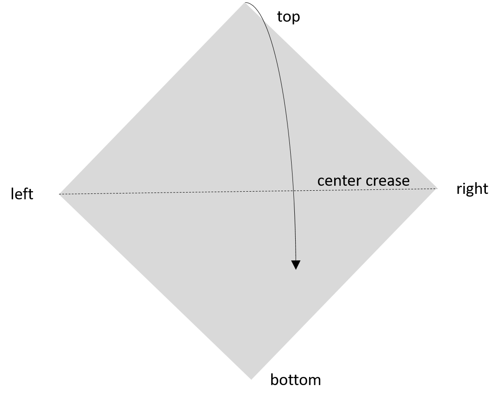
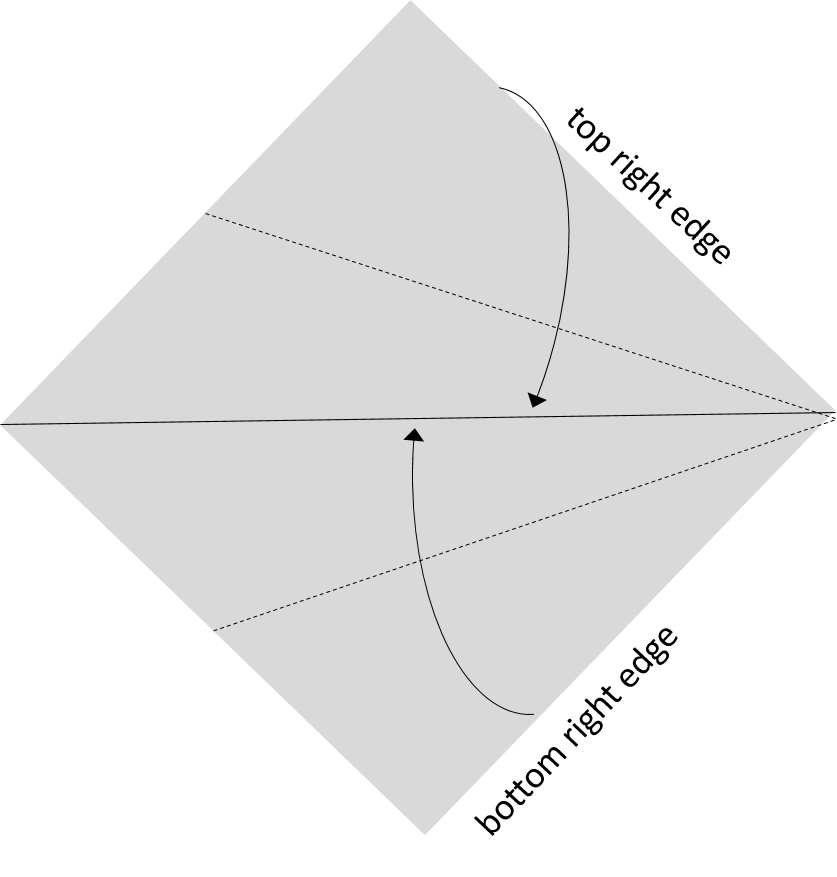
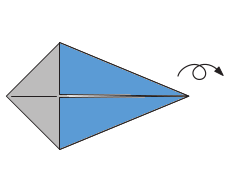
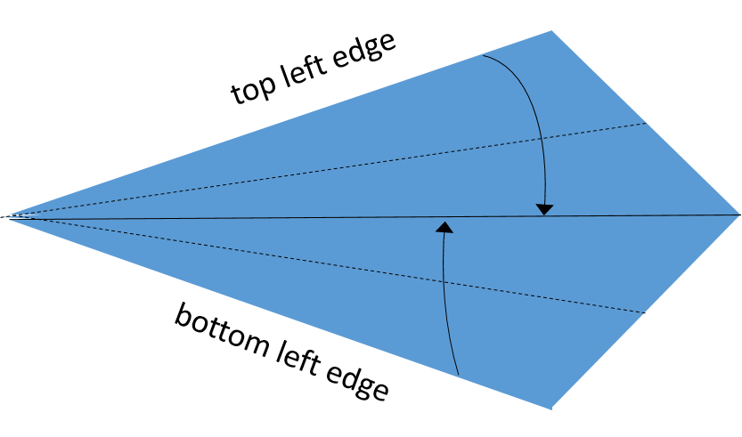
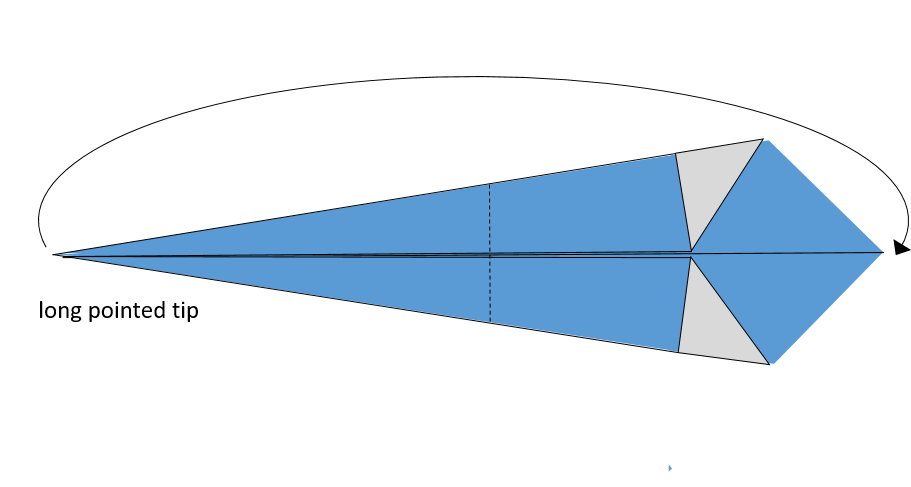
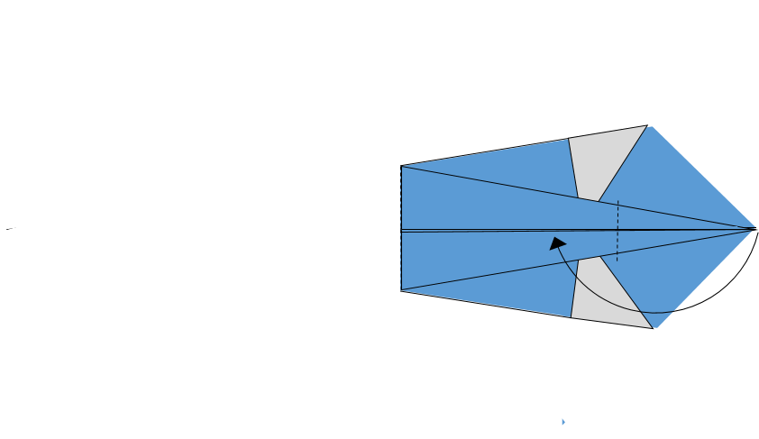
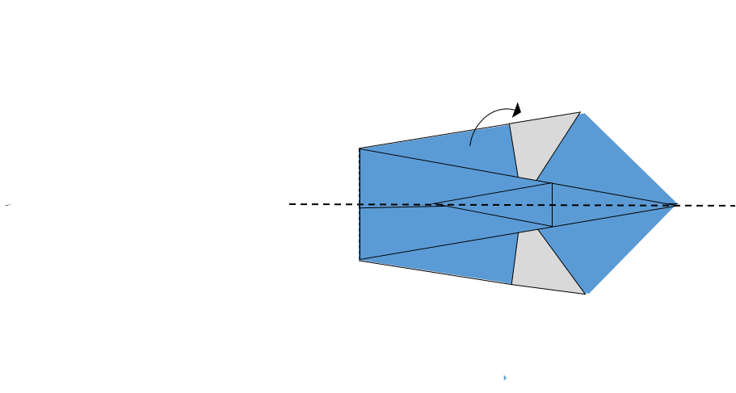
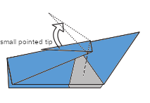
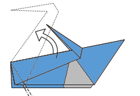
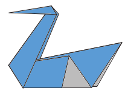

## Origami Swan - Full documentation

**Materials:**  
- 1 square sheet of paper (e.g. 15 × 15 cm)

---

### Step 1 – Orientation

1. Place the paper in front of you with **one corner pointing towards you** (diamond orientation).
2. Identify the corners as *top*, *bottom*, *left*, and *right* based on this orientation.
3. Fold the paper **in half diagonally**, bringing the top corner to the bottom corner.
4. Crease firmly, then unfold. This creates the **center crease**, which will serve as your reference line.

<!-- style="width:350px" -->

### Step 2 – Forming the Kite Base

5. Fold the **top right edge** inward so it aligns exactly with the **center crease**. Crease firmly.
6. Fold the **bottom right edge** inward so it aligns exactly with the **center crease**. Crease firmly.
7. The model now forms a **kite shape**, with the narrow tip pointing to the right.

<!-- style="float:left; width:350px" -->

<!-- style="width:350px; padding-top: 120px; padding-left: 120px" -->

### Step 3 – Narrowing the Kite

8. **Rotate the model 180° clockwise** so the narrow tip now points to the left.
9. **Flip the model over** so that the folded edges are now on the bottom and the smooth side is facing up.
10. Fold the **top left edge** inward to align with the center crease. Crease firmly.
11. Fold the **bottom left edge** inward to align with the center crease. Crease firmly.

<!-- style="width:350px" -->

### Step 4 – Forming the body

12. Take the **left long pointed tip** and fold it horizontally so that it aligns with the **right pointed tip**. Crease firmly.

<!-- style="width:350px" -->

13. Fold the tip **back to the left approximately one-third of its total length**. Crease firmly at the base.

<!-- style="width:350px" -->

14. Fold the entire model **in half along the center crease**, bringing the upper side under the lower side. Crease firmly.

<!-- style="width:350px" -->

---

### Step 4 – Forming the Neck and Head

15. Identify the **small pointed tip** (this will become the head).
16. Pull up the tip. Press at the base of the tip to set new crease.

17. Identify the **long part below the tip** (this will become the neck).
18. Pull up the long part below the small pointed tip. Press at the base of the long part to set new crease.

### Step 5 – Final Adjustments

17. Gently **pull the model apart** so the it can stand upright.
18. Ensure all creases are firm and the model is symmetrical.

**Finished:**  
You now have an origami swan. :-) 🦢

