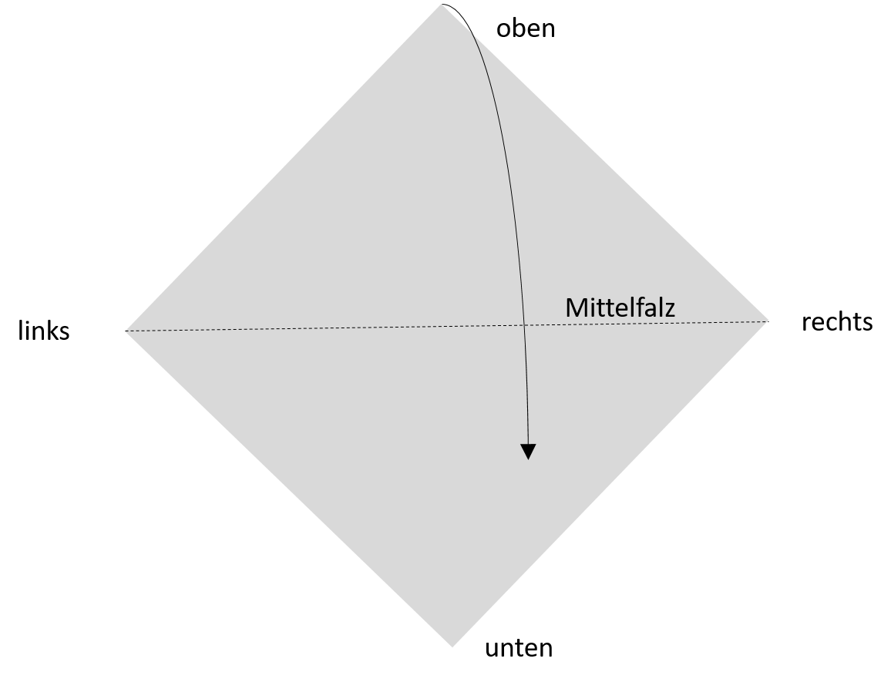
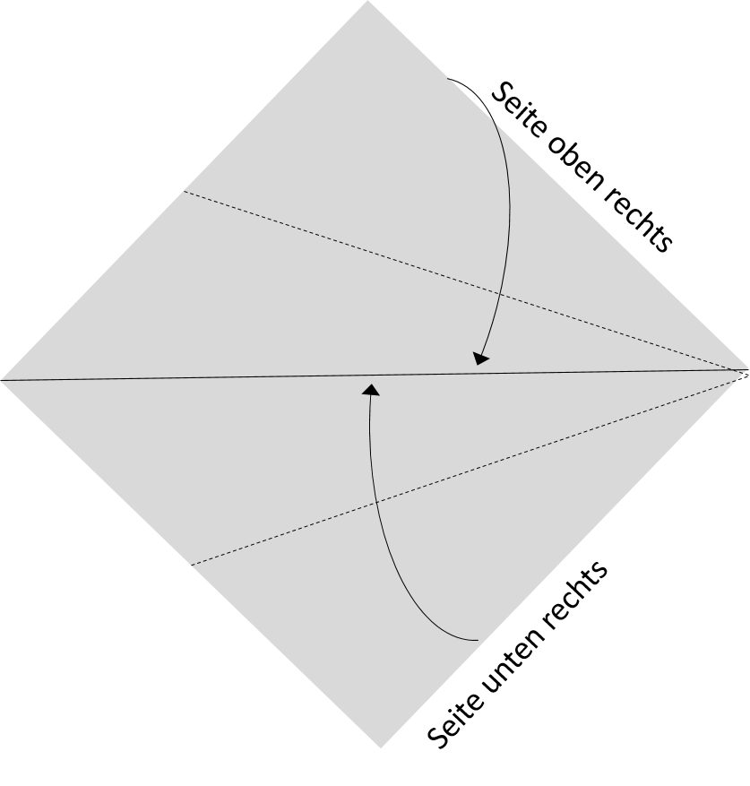
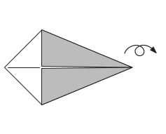
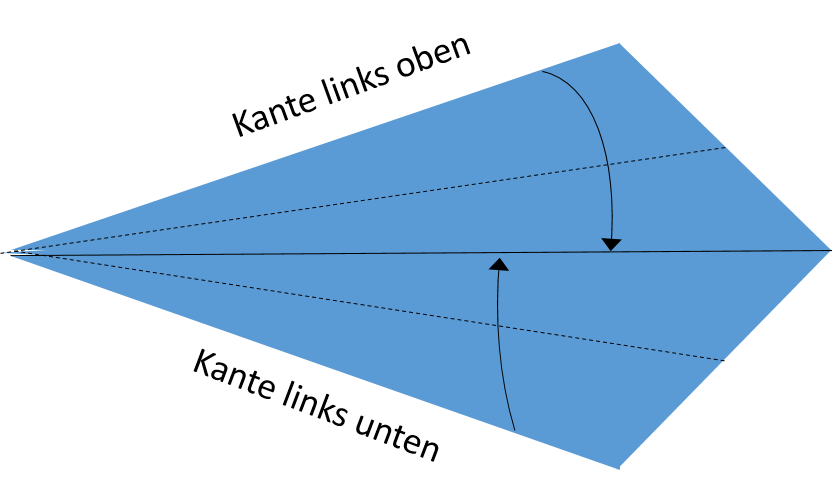
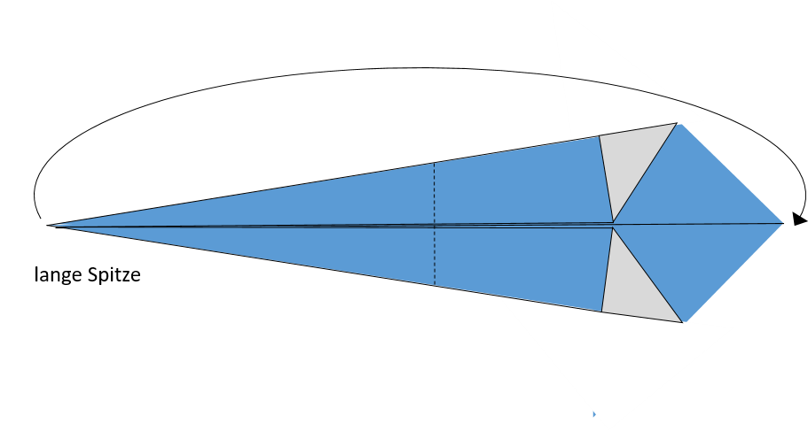
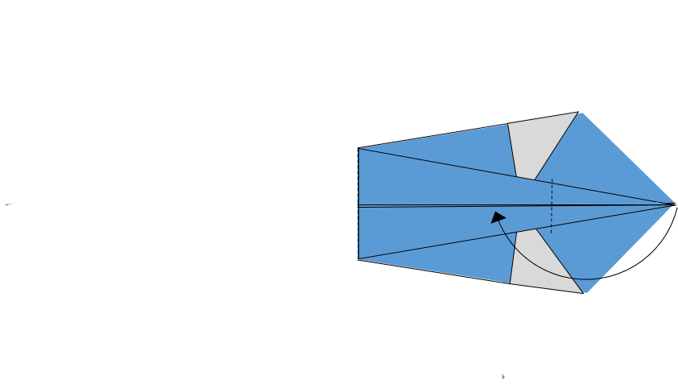
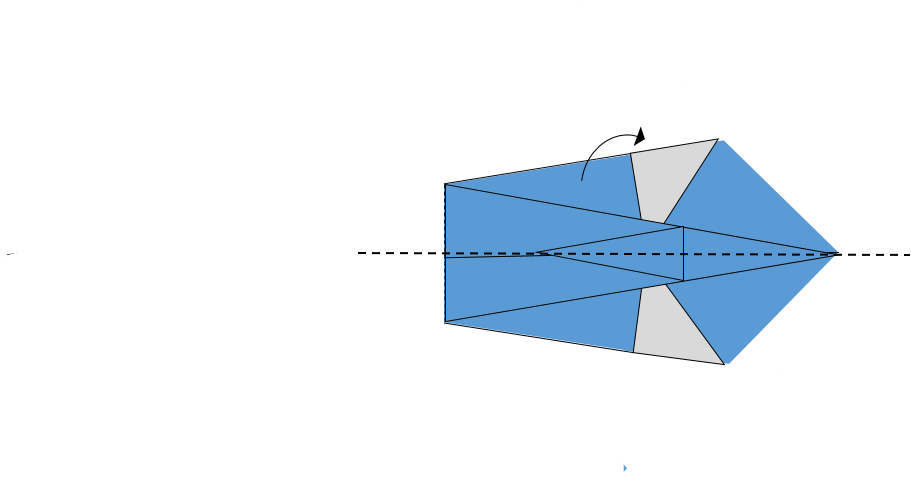
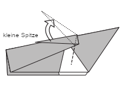

# Origami-Reproduktions-Challenge

>**“Reproduzierbarkeit und Dokumentation am Beispiel Origami”**

# Lernziele 🎯

🧠 Fachliche Lernziele

Die Teilnehmenden können …

- die Bedeutung von Dokumentation für die Reproduzierbarkeit von Ergebnissen erläutern.
- Unterschiede zwischen nicht dokumentierten, unstrukturiert dokumentierten und strukturiert dokumentierten Prozessen analysieren.
- Reproduktionsprozesse vergleichend analysieren und strukturiert reflektieren.
- Einflussfaktoren, die die Reproduktion eines Ergebnisses erleichtern oder erschweren, identifizieren und benennen.
- Die Origami-CHallenge als didaktische Methode analysieren und diskutieren.

👥 Soziale Lernziele

Die Teilnehmenden können …

- in Kleingruppen kooperativ an einer gemeinsamen Aufgabe arbeiten.
- Lösungsstrategien im Team aushandeln und Arbeitsschritte koordinieren.
- Schwierigkeiten und Lösungswege gemeinsam reflektieren und diskutieren.

## Arbeitsphase

Zeit: 15 Minuten (5 Minuten Einteilung & Aufgabenerläuterung, 10 Minuten Falten)

Die Teilnehmenden werden in drei Kleingruppen eingeteilt.

Die Aufgabe wird erläutert.

---

Gruppe A – „No Documentation“
---

Die Gruppe erhält mehrere Kopien eines fertig gefaltetes Origami-Modell (z. B. Herz, Frosch, Kranich).

**Rahmenbedingungen**:

- Keine schriftliche Anleitung
- Keine Skizzen
- Kein weiteres Hilfsmaterial erlaubt
- Das Modell darf betrachtet, untersucht, auseinandergefaltet werden.

**Challenge**:
Erstellt innerhalb der vorgegebenen Zeit so viele identische Kopien des Modells wie möglich.

Gruppe B – Unstrukturierte Dokumentation
---

Die Gruppe erhält eine unstrukturierte, rein schriftliche Anleitung zum Modell.

**Rahmenbedingungen**:

- Keine Skizzen
- Kein fertig gefaltetes Modell
- Text ohne klare Strukturierung

**Challenge**:
Erstellt innerhalb der vorgegebenen Zeit so viele identische Kopien des Modells wie möglich.

Gruppe C – Strukturierte Dokumentation
---

Die Gruppe erhält eine strukturierte, schrittweise Anleitung mit Skizzen.

**Rahmenbedingungen**:

- Kein fertig gefaltetes Modell
- Klar strukturierter Text
- Visualisierungen enthalten

**Challenge**:
Erstellt innerhalb der vorgegebenen Zeit so viele identische Kopien des Modells wie möglich.

Auswertung
---

Nach Ablauf der Arbeitszeit:

- War es möglich, das Modell zu reproduzieren?
- Wie viele Kopien wurden jeweils erstellt?
- Wie sehen die Kopien aus? Gibt es fehlerhafte Reproduktionen?
- Gibt es eine eindeutige „Siegergruppe“? 🏆

## Reflexionsphase

Austausch im Plenum

Zeit: 5 Minuten

Leitfragen:

- Welche Gruppe konnte am schnellsten reproduzieren? Warum?
- Welche Schwierigkeiten traten auf?
- Welche Strategien wurden entwickelt?
- Welche Rolle spielte die Art der Dokumentation?
- Warum unterschätzen wir oft die Bedeutung von Dokumentation?
- Welche impliziten Annahmen treffen wir über Vorwissen anderer?
  
=> „Was bedeutet das für wissenschaftliches Arbeiten?“

Was entspricht im wissenschaftlichen Kontext …

- dem fertigen Origami-Modell?
- der unstrukturierten Anleitung?
- der strukturierten Anleitung mit Skizzen?

Mögliche Analogien:

| Origami-Setting                     | Wissenschaftliche Entsprechung                                |
| ----------------------------------- | ------------------------------------------------------------- |
| Fertiges Modell ohne Anleitung      | Publikation ohne Methodenteil                                 |
| Unstrukturierte Textanleitung       | Unklare oder lückenhafte Methodendokumentation                |
| Strukturierte Anleitung mit Skizzen | Transparente, standardisierte, nachvollziehbare Dokumentation |

## Methodenreflexion

Austausch im Plenum
Zeit: 5 Minuten

- Austausch zur Methode

  - Hat die Übung Spaß gemacht?
  - Hat die Challenge motiviert?
  - Warum hat die Challenge motivert bzw. nicht motiviert?
  - Welche spielerischen Elemente enthält die Übung?

- Welche fachlichen und sozialen Lernziele könnten mit dieser oder einer ähnlichen Origami-Übung adressiert werden?

- Welche Risiken, Hürden oder Schwierigkeiten bringt die Methode mit sich?

# Origami-Modell Dokumentation

## Schwan – Vollständige Dokumentation

**Materialien:**  
- 1 quadratisches Blatt Papier (beliebige Größe, z. B. 15 × 15 cm)

---

## Schritt 1 – Ausrichtung

1. Lege das Papier vor dich mit **einer Ecke zu dir zeigend** (Rautenform).
2. Bestimme die Ecken entsprechend als *oben*, *unten*, *links* und *rechts*.
3. Falte das Papier **diagonal in der Mitte**, indem du die obere Ecke zur unteren Ecke führst.
4. Ziehe die Falz kräftig nach und öffne das Papier anschließend wieder. Dadurch entsteht die **Mittelfalz**, die als Referenzlinie dient.

---

## Schritt 2 – Die Drachenbasis formen

5. Falte die **Kante oben rechts** nach innen, sodass sie genau an der **Mittelfalz** anliegt. Falz gut andrücken.
6. Falte die **Kante unten rechts** nach innen, sodass sie genau an der **Mittelfalz** anliegt. Falz gut andrücken.

7. Das Modell hat nun die Form eines **Drachens**, mit der schmalen Spitze nach rechts.

---

## Schritt 3 – Den Drachen verschmälern

8. **Drehe das Modell um 180° im Uhrzeigersinn**, sodass die schmale Spitze nun nach links zeigt.
9. **Wende das Modell**, sodass die gefalteten Kanten unten liegen und die glatte Seite nach oben zeigt.
10. Falte die **Kante links oben** nach innen zur Mittelfalz. Gut andrücken.
11. Falte die **Kante links unten** nach innen zur Mittelfalz. Gut andrücken.

---

## Schritt 4 – Körper formen

12. Nimm die **linke lange Spitze** und falte sie so, dass sie auf die **kurze rechte Spitze** trifft. Gut andrücken.

13. Falte die Spitze **um ein Drittel ihrer Gesamtlänge zurück nach links**. An der Basis gut andrücken.

14. Falte das gesamte Modell **entlang der Mittelfalz**, indem du die obere Hälfte unter die untere bringst. Gut andrücken.

---

## Schritt 5 – Hals und Kopf formen

15. Finde die **kleine Spitze** (sie wird der Kopf).
16. Ziehe die Spitze nach oben und drücke an der Basis, um eine neue Falz zu setzen.
17. Bestimme den **langen Teil unterhalb der Spitze** (er wird der Hals).
18. Ziehe den langen Teil nach oben und drücke an der Basis, um die Falz zu fixieren.

---

## Schritt 6 – Letzte Anpassungen

17. Ziehe das Modell vorsichtig **auseinander**, sodass es aufrecht stehen kann.
18. Achte darauf, dass alle Falze sauber sind und das Modell symmetrisch ist.

**Fertig:**  
Du hast nun einen Origami-Schwan. 🦢

### Quelle

Alle Abbildungen nach Atsushi Tajiri
---

## Schwan – Schlechte Dokumentation

Nimm ein quadratisches Blatt Papier und falte es diagonal. Öffne es wieder, sodass eine Linie in der Mitte entsteht. Falte zwei Seiten zur Mitte, sodass eine Drachenform entsteht. Drehe es um. Falte die Seiten erneut zur Mitte, damit der Drache schmaler wird. Falte die lange Spitze zur anderen Spitze. Falte sie dann ein Stück zurück (etwa ein Drittel oder so). Klappe das Modell in der Mitte zusammen. Ziehe nun die kleine Spitze nach oben und drücke sie unten fest. Ziehe anschließend den längeren Teil darunter nach oben, um den Hals zu formen. Öffne das Modell unten ein wenig, damit es stehen kann.

Fertig. 🦢